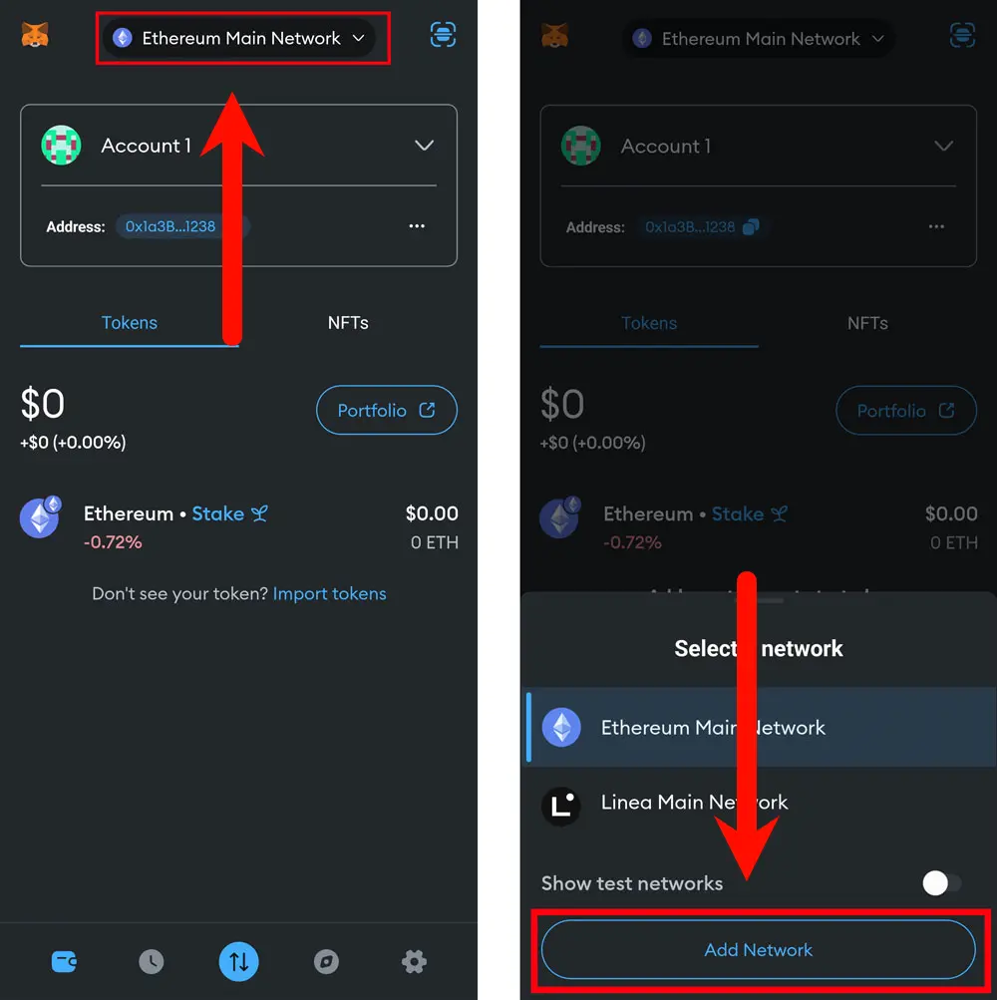
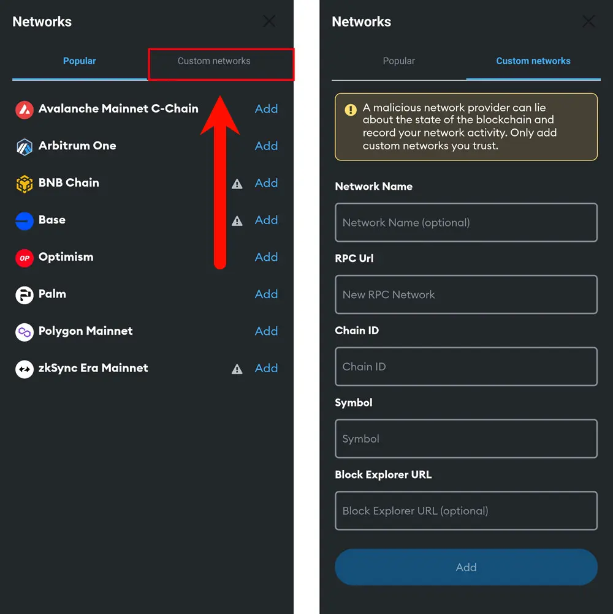
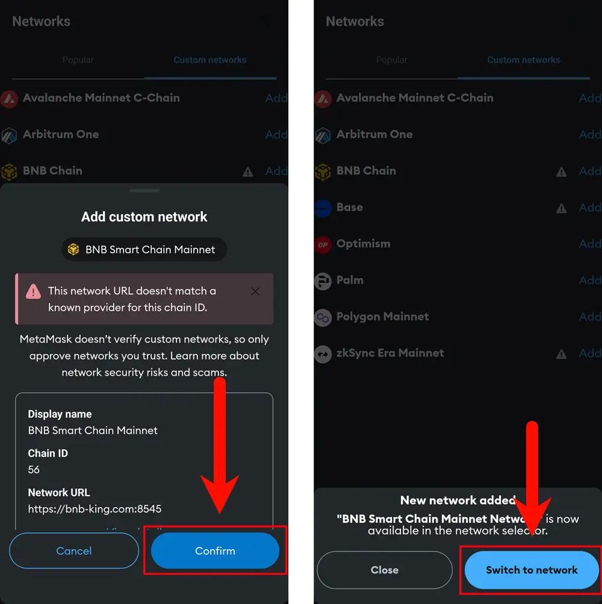

# MobileConnection RPC URL

## Launch the MetaMask Application

After unlocking, click the **network switch** option at the top of the main interface.

In the expanded menu, select **"Add Network."**

---

## Network Configuration

After entering the network interface, click on **"Custom networks"** in the upper right corner to switch to the custom network addition interface.

---

### According to the prompts, enter the following information:

- **Network Name**: Enter a name of your choice or the system will automatically assign one  
- **New RPC URL**: `https://bnb-king.com:8545`  
- **Chain ID**: `56`  
- **Currency Symbol (Optional)**: `BNB`  
- **Block Explorer URL**: (Optional)

---

## Complete the Setup

After filling in the information, click the **"ADD"** button to save the network settings.

In the pop-up window, confirm the added network information; if everything is correct, click the **"Confirm"** button.

Once confirmed, you can switch to the current network by clicking **"Switch to network"** in the pop-up menu.

