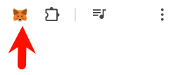
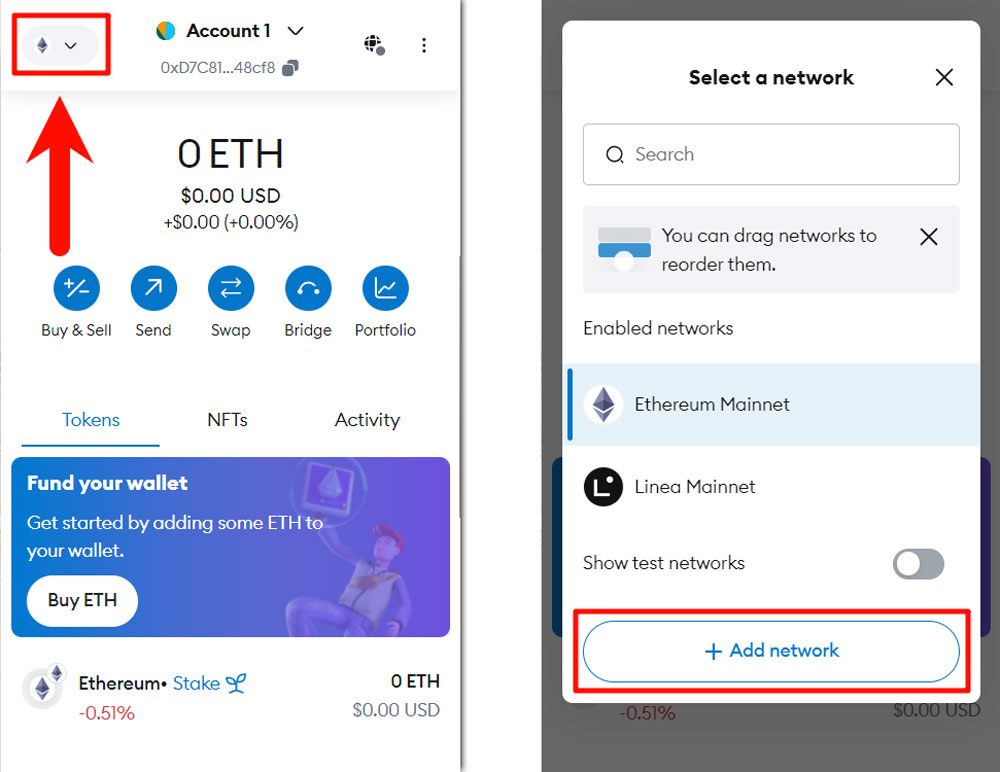
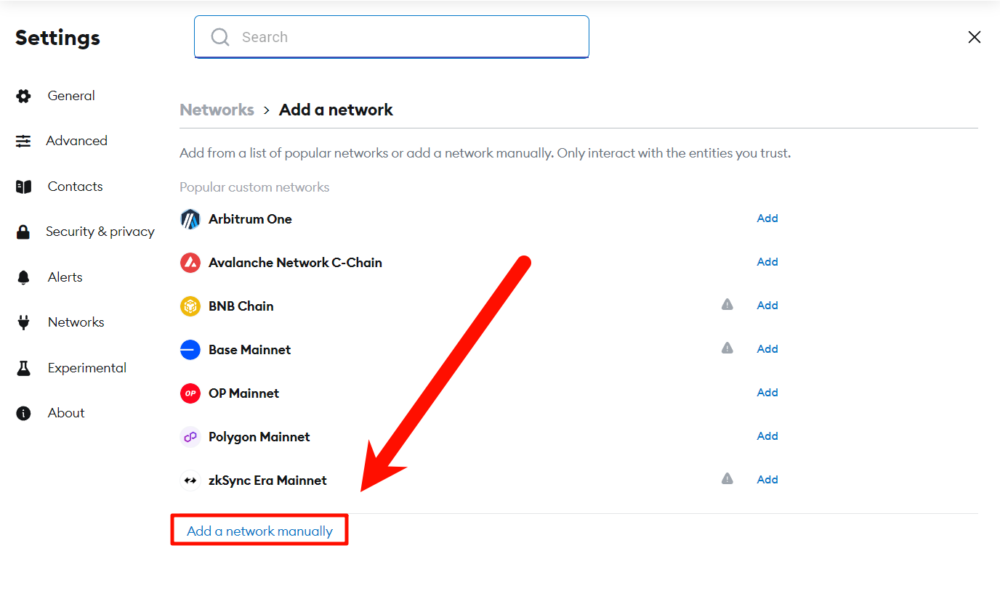
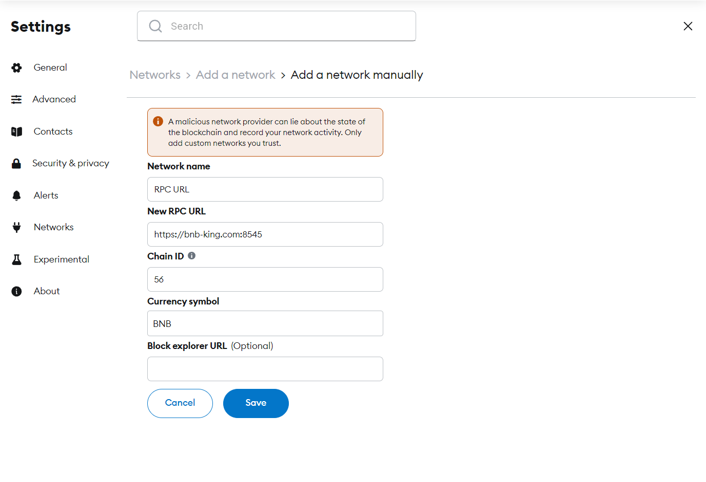
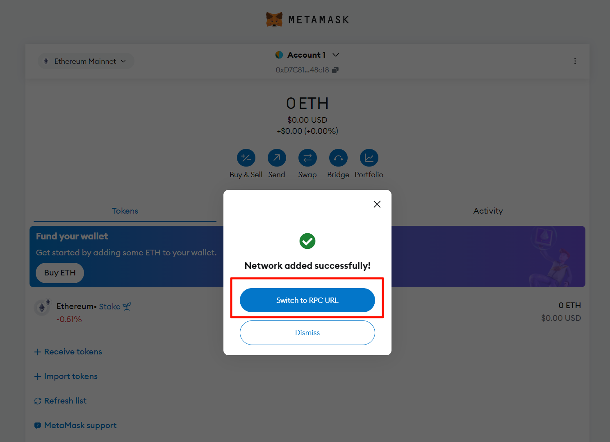

# PC Connects to RPC URL

## Opening the MetaMask Extension

Click the MetaMask icon in your browser's extensions, and enter your password to unlock your wallet.

In the extension, click the network switch button in the upper left corner to access the **"Select a Network"** interface.

In the pop-up **"Add Network"** page, click the **"Add Network"** button at the bottom.

Click **"Add a network manually"** in the lower left corner of the page.

---

## Fill in Configuration Information

- **Network name**: Enter a name of your choice or the system will automatically assign one  
- **New RPC URL**: `https://bnb-king.com:8545`  
- **Chain ID**: `56`  
- **Currency symbol**: `BNB`  
- **Block explorer URL**: (Optional)

---

## Completing the Setup

After filling in the information, click the **"Save"** button.

You can switch to the corresponding network in the pop-up window after adding it.

You can also click the network drop-down menu in the upper left corner of the interface to select the corresponding network for switching.

