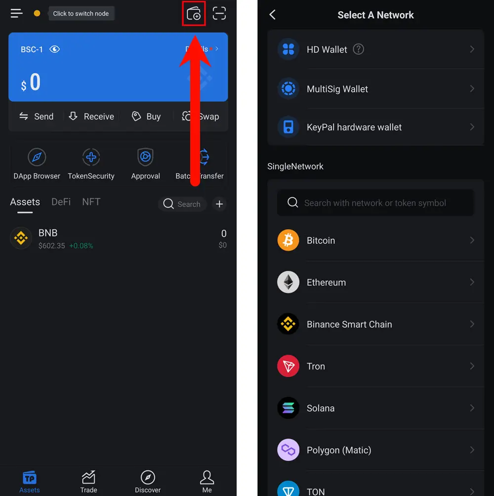
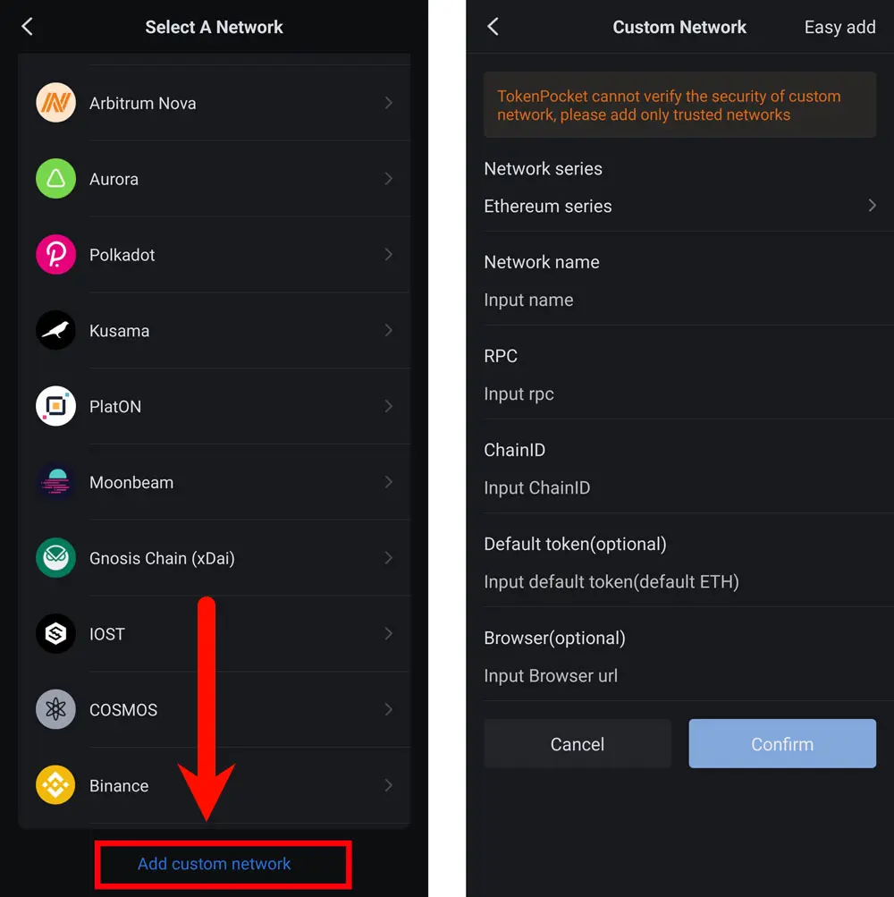
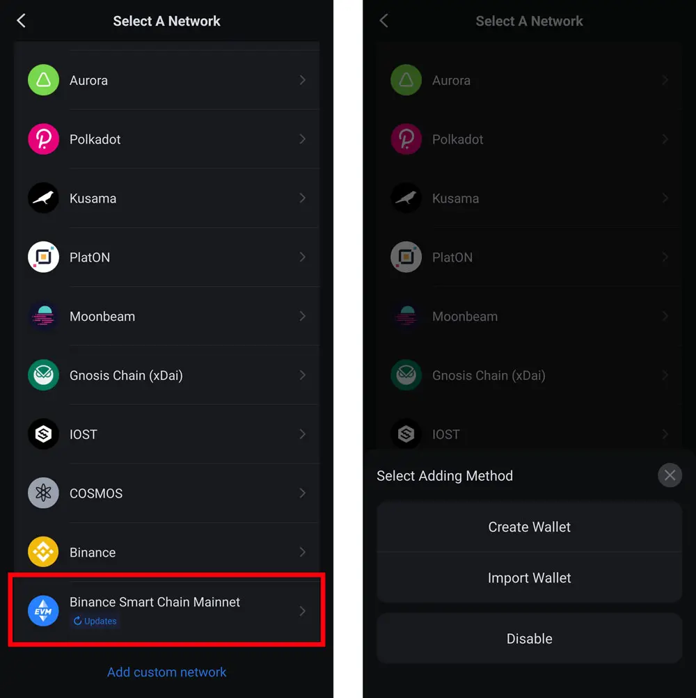
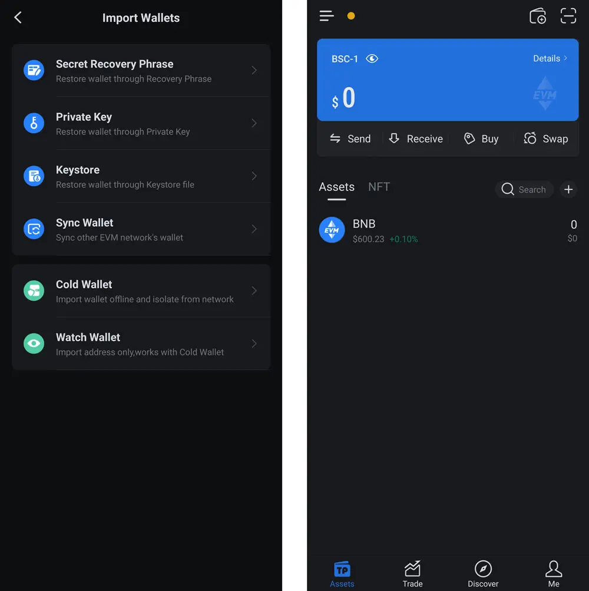

# Connecting to RPC URL

## Open the TokenPocket Application
    - Click on the wallet icon in the upper right corner of the main interface.
    - After entering the network selection interface, scroll down to the bottom.

## Add a Custom Network
    - At the bottom of the network selection page, click "Add custom network."
    - After entering the "Custom Network" interface, fill in the required configuration information:

**Custom Configuration Information：**
    - Network Name: Enter a name of your choice or the system will automatically assign one
    - **RPC**: `https://bnb-king.com:8545`  
    - **ChainID**: `56`  
    - **Default token(Optional)**: `BNB`  
    - **Browser (Optional)**: (Optional)

## Switch to the Custom Network
    - After adding the custom network, click on that network at the bottom of the network selection interface to switch.
    - In the pop-up menu, choose "Create New Wallet" or "Import Wallet."

    - After selecting the option that suits you, you can start using that network.

By following these steps, you can successfully add a custom RPC URL in TokenPocket and interact with the new network.