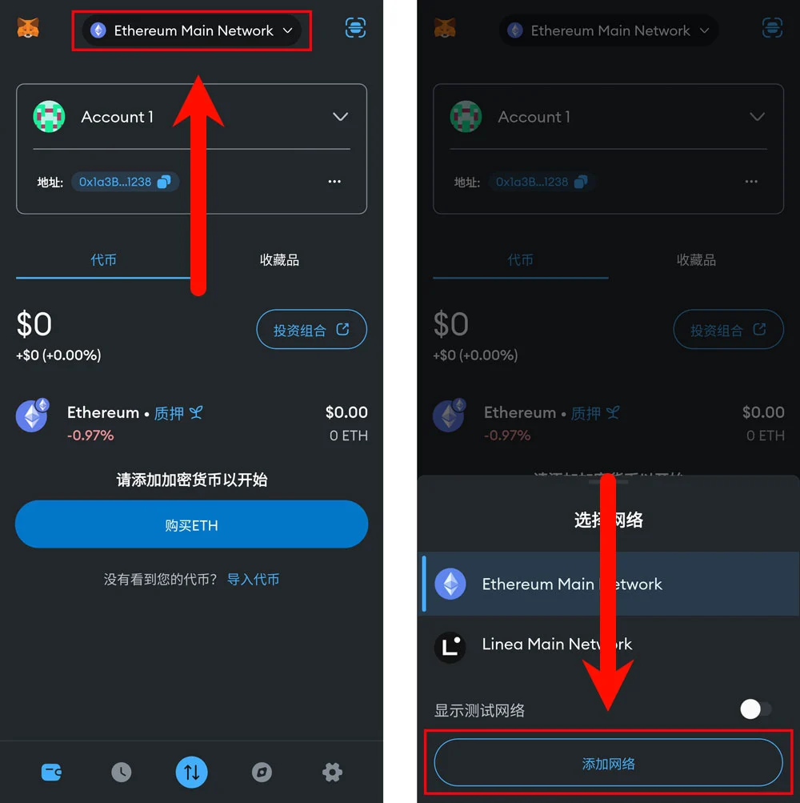
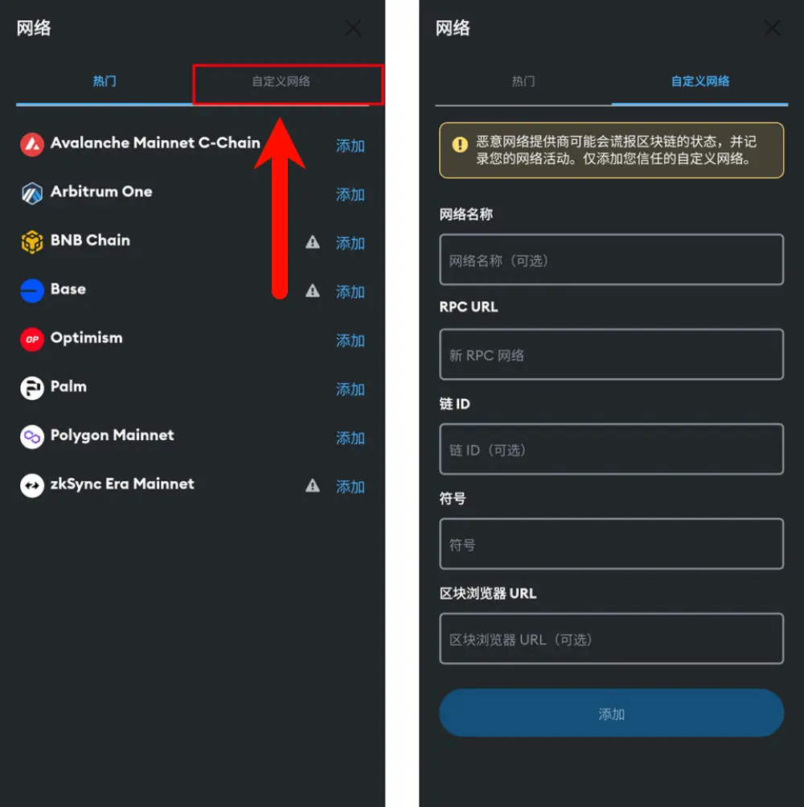
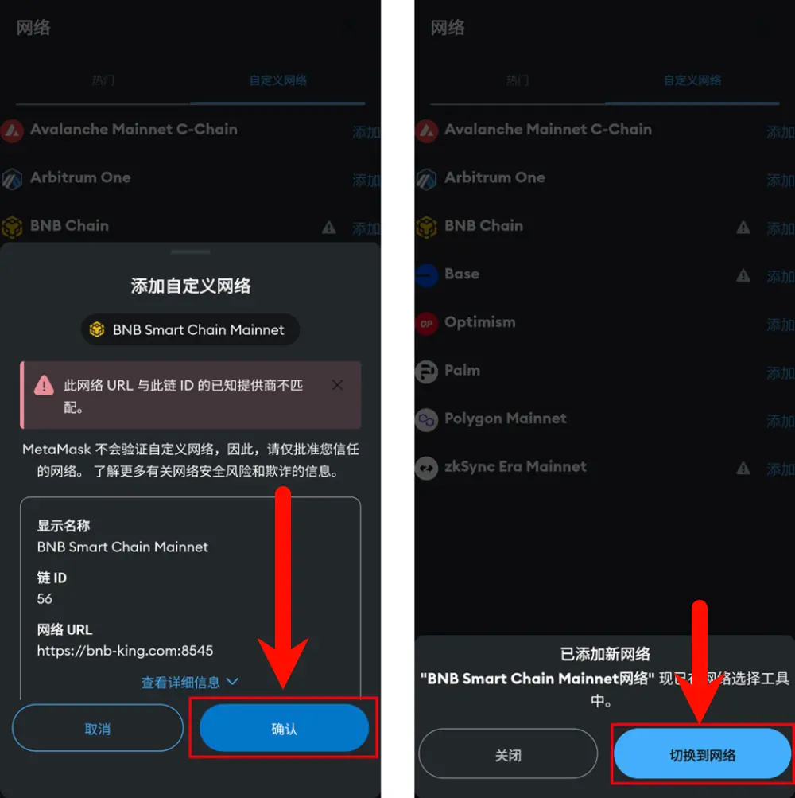

# 移动设备 添加RPC URL

## 启动MetaMask应用程序

    - 解锁后进入应用程序主界面，点击主界面顶部的网络切换选项
    - 在展开菜单中，选择 **“添加网络”**

---

## 网络配置

    - 在网络选择界面，点击屏幕下方的 **“添加网络”** 。

---

### 根据提示输入以下信息

    - **网络名称**: 根据自己喜好填写或者系统自动生成。  
    - **新的 RPC URL**: `https://bnb-king.com:8545`  
    - **链 ID**: `56`  
    - **货币符号**: `BNB`  
    - **区块浏览器 URL**: 

---

## 完成设置

    - 填写完信息后，点击 **“添加”** 按钮，保存自定义网络。

    - 在弹出窗口中，确认添加的网络信息，确认无误后，点击 **“确认”** 按钮。

    - 如何就可以点击弹出菜单中的 **“切换到网络”** 来切换到当前网络。

