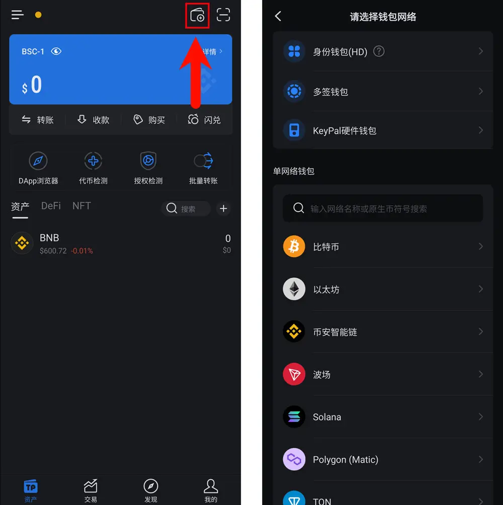
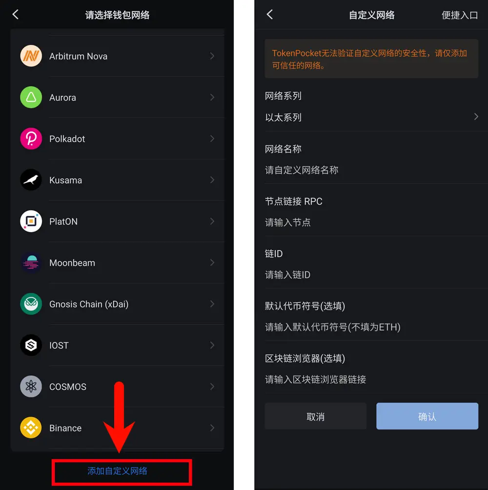
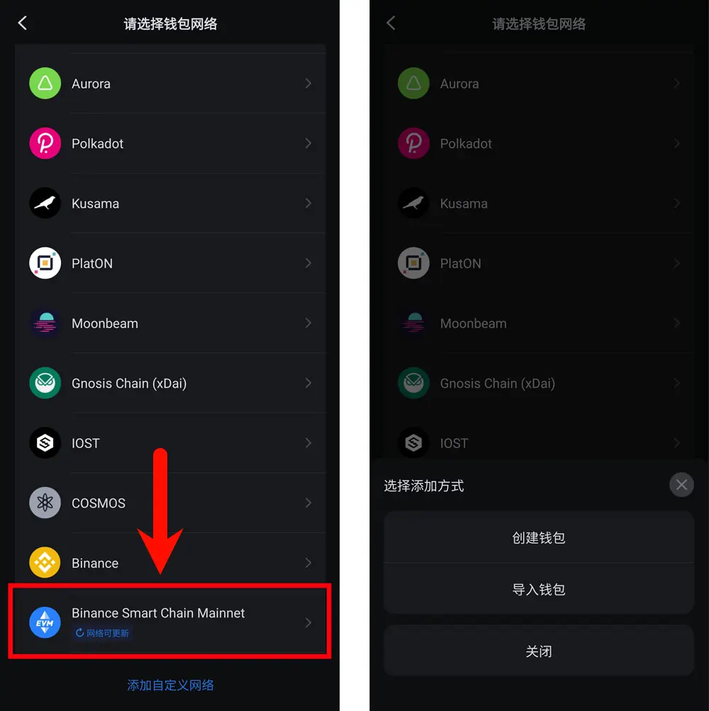
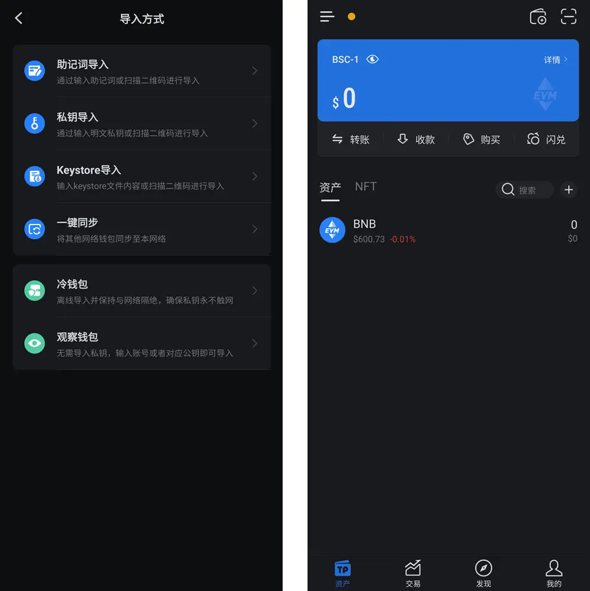

# 移动设备 添加RPC URL

## 打开TokenPocket应用
    - 在主界面点击右上角的钱包图标
    - 进入网络选择界面后，往下拉至底部

## 添加自定义网络
    - 在选择网络页面最底部，点击 **“添加自定义网络”**
    - 进入 **"Custom Network"** 界面后，根据要求填写对应配置内容

## 自定义配置信息：
    - 网络名称: 根据自己喜好填写或系统自动生成。
    - **节点链接 RPC**:  `https://bnb-king.com:8545`  
    - **链ID**: `56`
    - **默认代币符号**: `BNB` 
    - **区块浏览器**: 

## 切换到自定义网络
    - 自定义网络添加完成后，在网络选择界面最下方点击该网络进行切换
    - 在弹出菜单中选择 **“新建钱包”** 或 **“导入钱包”**

    - 根据内容选择适合你的选项后即可使用该网络

通过这些步骤，你就可以在TokenPocket中成功添加自定义的RPC URL，并与新网络进行交互。